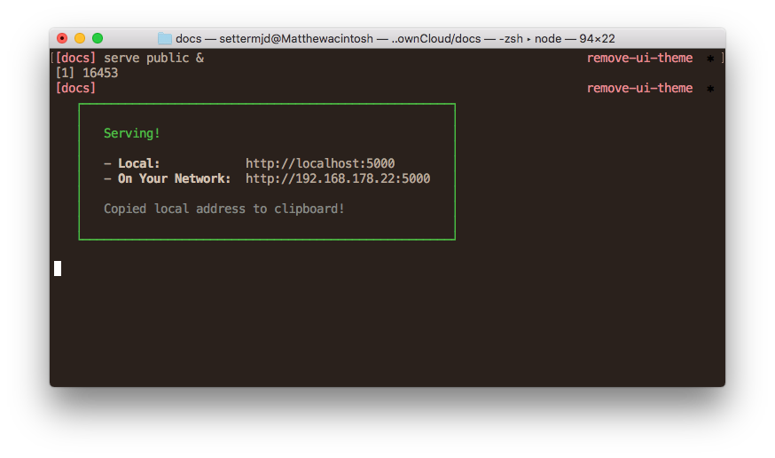

# Building the Documentation

You're now ready to build (generate) the ownCloud documentation.
The documentation can be generated in HTML and PDF formats.

## Generating HTML Documentation

There are two ways to generate the documentation in HTML format:

- Using ownCloud's custom Antora Docker Container
- Running Antora from the Command-Line

### Using the Docker Container

To build the documentation using the Docker container, from the command line, in the root of the docs directory, run the following command:

```
docker run -ti --rm \
    -e DOCSEARCH_ENABLED=true \
    -e DOCSEARCH_ENGINE=lunr \
    -v $(pwd):/antora/ \
    -w /antora/ \
    owncloudci/antora:latest \
    --pull \
    --cache-dir /antora/cache/ \
    --redirect-facility static \
    --generator ./generators/search.js \
    --stacktrace \
    site.yml
```

This command:

- Starts up [ownCloud's custom Antora Docker container](https://hub.docker.com/r/owncloudci/antora/)
- Runs Antora's `generate` command, which regenerates the documentation
- You can add the `--clean` option to clean the build directory of any leftover artifacts from the previous build, including PDF's.

If all goes well, you will _not_ see any console output.
If a copy of the container doesn't exist locally, you can pull down a copy, by running `docker pull owncloudci/antora:latest`.
Otherwise, you should see output similar to the following:

```console
Unable to find image 'owncloudci/antora:latest' locally
latest: Pulling from owncloudci/antora
605ce1bd3f31: Already exists
0511902e1bcd: Downloading  5.347MB/19.61MB
343e34c41f87: Download complete
1e0ba8eb567c: Downloading  4.569MB/37.51MB
d5a49762c0f9: Download complete
```

### Using Make

This is the easiest way to build the documentation using predefined settings.

```
make html
```

### Using the Antora Tools On The Command-Line

If you want to use your own settings, run the command passing the necessary parameters manually, as in the example below.

**Note:** The environment variables at the beginning are required for building the docs with integrated site search.

```
DOCSEARCH_ENABLED=true DOCSEARCH_ENGINE=lunr antora --pull \
    --cache-dir ./cache/ \
    --redirect-facility static \
    --generator ./generators/search.js \
    --stacktrace \
    site.yml
```

- You can add the `--clean` option to clean the build directory of any leftover artifacts from the previous build, including PDF's.

### Update The Generated Search Index

The playbook file (`site.yml`) sets the `site.url` configuration directive to `http://localhost:5000`.
It's likely fair to assume that this isn't the domain where the documentation will be hosted.

Using `sed`, such as in the following example, from the root directory of the project should suffice.

```bash
#!/bin/bash
set -e
sed -i 's/localhost:5000/<hosted domain and port>/g' public/search_index.json
```

### Viewing The HTML Documentation

Assuming that there are no errors, the next thing to do is to view the result in your browser.
In case you have already installed a webserver, you need to make the html docmentation
available pointing to subdirectory `public`
or for easy handling use the [NPM Serve tool](https://www.npmjs.com/package/serve) so that you can view your changes,
before committing and pushing the changes to the remote docs repository.
You could also use [PHP's built-in webserver](https://secure.php.net/manual/en/features.commandline.webserver.php) as well.

The following example uses *Serve*, to start it run the following command in the root of your docs repository:

```
serve public &
```

This starts Serve and set it running in the background, using the `public` directory, (re)generated by `antora site.yml`, as the document root, listening on `http://localhost:5000`.
_The URL is automatically copied to the clipboard._



Open the URL in your browser of choice and you'll see two links, as below.


If you're happy with your changes, as with any other change, create a set of meaningful commits and push them to the remote repository.
If you're _not_ satisfied with the changes, however, continue to make further updates, as necessary, and run `antora site.yml` afterwards.
Your changes will be reflected in the local version of the site that Serve is rendering.

We hope that you can see that contributing to the documentation using Antora is a pretty straight-forward process, and not _that_ demanding.

## Generating PDF Documentation

To generate the documentation in PDF format, you need to have `asciidoctor-pdf` and GNU `make` installed, as PDF generation isn't, _yet_, supported by Antora.
To install asciidoctor-pdf, please refer to [the official installation instructions](https://asciidoctor.org/docs/asciidoctor-pdf/).
To install GNU Make, please refer to the link below for your operating system:

- [Linux](https://www.cyberciti.biz/faq/howto-installing-gnu-c-compiler-development-environment-on-ubuntu/)
- [macOS](http://brewformulas.org/Make)
- [Microsoft Windows](http://gnuwin32.sourceforge.net/install.html)

When installed, run the command below in the root directory of the repository, to generate PDF versions of the _administration_, _developer_ and _user_ manuals.

```console
make pdf
```

`make pdf` invokes [asciidoctor-pdf](https://github.com/asciidoctor/asciidoctor-pdf) and passes it:

1. **The configuration file to use**

    This configuration file, based on [the asciidoctor-pdf theming guide](https://github.com/asciidoctor/asciidoctor-pdf/blob/master/docs/theming-guide.adoc), contains all the essential details required to build a PDF version of one of the manuals.

    This includes the list of files to use as the PDF's source material as well as the required YAML front-matter. The front-matter includes details such as whether to render a table of contents, the icon set to use, and the images base directory.

2. **The custom theme directory and the custom theme file**

    This ensures that the defaults are overridden, where relevant, to ensure that the generated PDF is as close to the current ownCloud style as possible.

## Viewing Build Errors

If an aspect of your change contains invalid AsciiDoc, then you'll see output similar to the example below.

```console
asciidoctor: ERROR: index.adoc: line 25: only book doctypes can contain level 0 sections
```

There, you can see:

- That an error was found
- The file it was found in
- The line of that file where it is located
