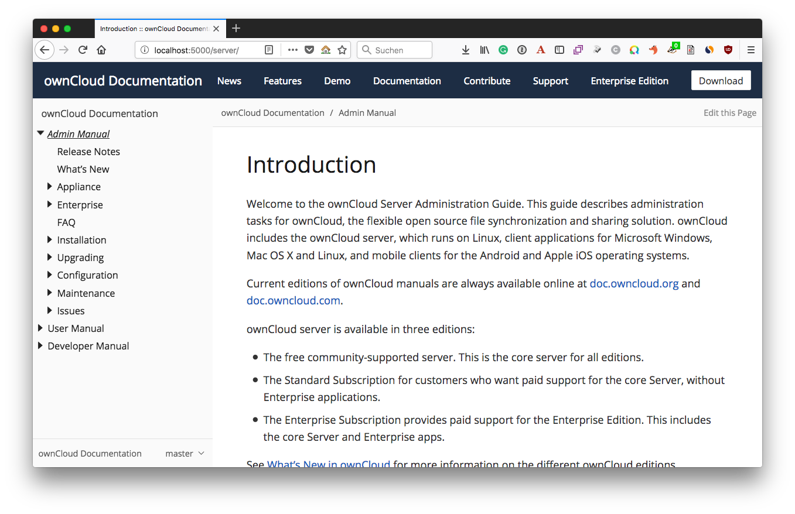

# Building the Documentation
[link-git]: https://git-scm.com
[link-Node]: https://nodejs.org
[link-Gulp-CLI]: http://gulpjs.com
[link-Yarn]: https://yarnpkg.com
[link-git-package]: https://git-scm.com/downloads
[link-nvm]: https://github.com/creationix/nvm
[link-nvm-installation-instructions]: https://github.com/creationix/nvm#installation
[link-open-windows-cmd-prompt]: https://www.lifewire.com/how-to-open-command-prompt-2618089
[link-mingw]: http://mingw.org/wiki/msys
[link-gnu-make]: https://www.gnu.org/software/make/

## Install the Prerequisites

Before you can build the ownCloud documentation, you need to install the following software:

- [git][link-git] (command: `git`)
- [Node][link-Node] (command: `node`)
- [Yarn][link-Yarn] (command: `yarn`)

### Checking for the Prerequisites on Linux

To check if they are installed, when running a Linux distribution, run the following command:

```
dependencies=( git node npm yarn ) && for i in "${dependencies[@]}"; do command -v $i; done;
```

You will see the path to each binary displayed, if it is installed.
For any that you do not see displayed, follow the instructions below to install it.
This is an example output if you have everything installed. Please consider that the home directory, root in this example, is dependent on the user you used during installing and can be different in your installation.

```
/usr/bin/git
/root/.nvm/versions/node/v12.19.0/bin/node
/root/.nvm/versions/node/v12.19.0/bin/npm
/usr/bin/yarn
```

### Checking for the Prerequisites on Microsoft Windows

To check if the software is installed, when running Microsoft Windows, run the following commands in [the Windows Command Prompt][link-open-windows-cmd-prompt]:

```
git --version
node --version
yarn --version
```

### Install Prerequisites

If one or more of these commands reports an error, then that prerequisite is not installed.
For any prerequisite that is not installed, follow the instructions below to install it.

#### git

To install git, download and install the [git package][link-git-package] for your operating system, or use your package manager, if you are using a Linux distribution.

#### Node

While you can install Node from the official packages, we strongly recommend that you use [NVM][link-nvm] (Node Version Manager) to install and manage Node.
Follow the [NVM installation instructions][link-nvm-installation-instructions] to set up NVM on your machine.
Once you've installed NVM, open a new terminal and install Node using the following command:

```
nvm install --lts
```

You can switch to a specific version of Node at any time using the following command:

```
nvm use 10
```

To make Node 10 the default in new terminals, type:

```
nvm alias default 10
```

#### Yarn

To [install yarn](https://yarnpkg.com/lang/en/docs/install) following the installation instructions for your operating system.

## Install Antora's Dependencies

Before you can build the documentation, you need to install Antora's dependencies.
To install them, you need to run `yarn install`, from the command line in the root directory of the `docs` directory.
This will install all the dependencies specified in `package.json` (which is located in the root directory of the `docs` directory).

**Note:** If your environment already has [GNU make][link-gnu-make] installed, you can run `make setup` instead, from the root of the `docs` directory. If you are using Microsoft Windows, GNU make is available as part of [the MinGW package][link-mingw].

With the dependencies installed, you are now ready to build (generate) the ownCloud documentation.

## Prepared Yarn Commands

To see all prepared yarn commands run following command:

```console
yarn run

yarn run vv1.15.2
info Commands available from binary scripts: antora, blc, broken-link-checker, crc32, ecstatic, errno, esparse, esvalidate, handlebars, he, hs, http-server, isogit, js-yaml, json5, mime, mkdirp, nopt, opener, os-name, osx-release, printj, semver, sha.js, strip-ansi, supports-color, uglifyjs, write-good, writegood
info Project commands
   - antora
      antora --stacktrace generate --cache-dir cache --redirect-facility disabled --generator ./generator/generate-site.js --clean --fetch --attribute format=html site.yml
   - linkcheck
      broken-link-checker --filter-level 3 --recursive --verbose
   - prose
      write-good --parse **/*.adoc
   - serve
      http-server public/ -d -i
   - validate
      antora --stacktrace generate --cache-dir cache --redirect-facility disabled --generator ./generator/xref-validator.js --clean --fetch --attribute format=html site.yml
question Which command would you like to run?:
```
Please see the [documentation](https://yarnpkg.com/lang/en/docs/cli/run/)
for more information about the the `yarn run` command.

## Generating the Documentation

The documentation can be generated in HTML and PDF formats.

### Generating HTML Documentation

There are two ways to generate the documentation in HTML format:

- Running Antora from the Command-Line
- Using ownCloud's custom Antora Docker Container


#### Using Antora from the Command-Line

Using Yarn, as in the example below, is the easiest way to build the documentation. This project has a predefined target (`antora`) which calls Antora, supplying all of the required options to build the docs, to build the documentation on any branch of [the ownCloud documentation repository](https://github.com/owncloud/docs).

```
yarn antora
```

#### Additional Command Line Parameters

You can add additional parameters to the current defined ones. For example, defining the default URL
or additional global attributes. Just add them after the `yarn antora` command. 

##### Overwrite the Default URL
If you want to serve your changes locally, you have to overwrite the default URL, which points to https://doc.owncloud.com. You can append a custom URL to the command like this:

```console
yarn antora --url http://localhost:8080
```

##### Attribute Error Searching and Fixing

It is very beneficial to use command line attributes when searching and fixing attribute errors. This can be
necessary when you get warnings like: `WARNING: skipping reference to missing attribute: <attribute-name>`

- First, you may want to search if the attribute-name is used as an attribute all. Run in docs root\
`grep -rn --exclude-dir={public,.git,node_modules} \{attribute-name`\
If found, check if the attribute definition is made or passed or needs exclusion. 
- Second, if no result is found, it may be the case that the erroring attribute is not in the master
branch but in another one. This can be identified by adding a custom attribute to the yarn antora command like:\
`--attribute the-erroring-attribute=HUGO` where HUGO can be anything that is not used and easy to grep.
- Finally, run in `public` directory: `grep -rn HUGO`. You will see exactly in which branch and file the issue occurs.
If it is a branch other than `master` and an ongoing but not merged fix that targets this issue, you have to
merge the changes first, and then backport them to the branch. Do not forget to sync the branch post merging too.
Having done that, re-running `yarn antora` should eliminate that particular missing attribute warning.

##### Fixing a Directory Not Found Error

If you get an error like: `Error: ENOENT: no such file or directory, lstat '/var/owncloud/docs/cache/`, you just need
to delete the contents of the `cache` directory and restart building the docs.

#### Using the Docker Container

To build the documentation using the Docker container, from the command line, in the root of the docs directory, run the following command:

```
docker run -ti --rm \
    -v $(pwd):/antora/ \
    -w /antora/ \
    owncloudci/nodejs:11 \
    yarn install

docker run -ti --rm \
    -v $(pwd):/antora/ \
    -w /antora/ \
    owncloudci/nodejs:11 \
    yarn antora
```

If you want to serve your changes locally you have to overwrite the default URL, which points to https://doc.owncloud.com. You can append a custom URL to the command like this:

```
docker run -ti --rm \
    -v $(pwd):/antora/ \
    -w /antora/ \
    owncloudci/nodejs:11 \
    yarn antora --url http://localhost:8080
```

These commands:

- Start up [ownCloud's NodeJS Docker container](https://hub.docker.com/r/owncloudci/nodejs/)
- Run Antora's `generate` command, which regenerates the documentation
- You can add the `--fetch` option to update the dependent repositories, or any other available flag.

If all goes well, you will _not_ see any console output. If a copy of the container doesn't exist locally, you can pull down a copy, by running `docker pull owncloudci/nodejs:11`. Otherwise, you should see output similar to the following:

```console
Unable to find image 'owncloudci/nodejs:11' locally
11: Pulling from owncloudci/nodejs
3b37166ec614: Already exists
504facff238f: Already exists
ebbcacd28e10: Already exists
c7fb3351ecad: Already exists
2e3debadcbf7: Already exists
a5aa5acbbb21: Already exists
fec54bf92721: Already exists
37568f2dfa71: Pull complete
cec1230fab6b: Pull complete
08e882bea23f: Pull complete
78bc608ac308: Pull complete
Digest: sha256:d7706c693242c65b36b3205a52483d8aa567d09a1465707795d9273c0a99c0c2
Status: Downloaded newer image for owncloudci/nodejs:11
```

### Viewing The HTML Documentation

Assuming that there are no errors, the next thing to do is to view the result in your browser. If you have already installed a webserver, you need to make the HTML documentation available pointing to subdirectory `public` or for easy handling use our predefined Yarn target so that you can view your changes, before committing and pushing the changes to the remote docs repository. You could also use [PHP's built-in webserver](https://secure.php.net/manual/en/features.commandline.webserver.php) as well.

The following example uses our Yarn target, to start it run the following command in the root of your docs repository:

```
yarn serve
```

This starts a simple webserver, using the `public` directory, (re)generated by `antora`, as the document root, listening on `http://localhost:8080`. Open the URL in your browser of choice and you'll see two links, as below.



If you're happy with your changes, as with any other change, create a set of meaningful commits and push them to the remote repository. If you're _not_ satisfied with the changes, however, continue to make further updates, as necessary, and run `antora` afterwards. Your changes will be reflected in the local version of the site that Serve is rendering.

We hope that you can see that contributing to the documentation using Antora is a pretty straight-forward process, and not _that_ demanding.

### Generating PDF Documentation

To generate the documentation in PDF format, you need to have `asciidoctor-pdf` and GNU `make` installed, as PDF generation isn't, _yet_, supported by Antora. To install `asciidoctor-pdf`, please refer to [the official installation instructions](https://asciidoctor.org/docs/asciidoctor-pdf/). To install GNU Make, please refer to the link below for your operating system:

- [Linux](https://www.cyberciti.biz/faq/howto-installing-gnu-c-compiler-development-environment-on-ubuntu/)
- [macOS](http://brewformulas.org/Make)
- [Microsoft Windows](http://gnuwin32.sourceforge.net/install.html)

When installed, run the command below in the root directory of the repository, to generate PDF versions of the _administration_, _developer_ and _user_ manuals.

```console
make pdf
```

`make pdf` invokes [asciidoctor-pdf](https://github.com/asciidoctor/asciidoctor-pdf) and passes it:

1. **The configuration file to use**

    This configuration file, based on [the asciidoctor-pdf theming guide](https://github.com/asciidoctor/asciidoctor-pdf/blob/master/docs/theming-guide.adoc), contains all the essential details required to build a PDF version of one of the manuals.

    This includes the list of files to use as the PDF's source material as well as the required YAML front-matter. The front-matter includes details such as whether to render a table of contents, the icon set to use, and the images base directory.

2. **The custom theme directory and the custom theme file**

    This ensures that the defaults are overridden, where relevant, to ensure that the generated PDF is as close to the current ownCloud style as possible.

### Viewing Build Errors

If an aspect of your change contains invalid AsciiDoc, then you'll see output similar to the example below.

```console
asciidoctor: ERROR: index.adoc: line 25: only book doctypes can contain level 0 sections
```

There, you can see:

- That an error was found
- The file it was found in
- The line of that file where it is located
