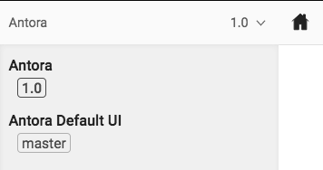
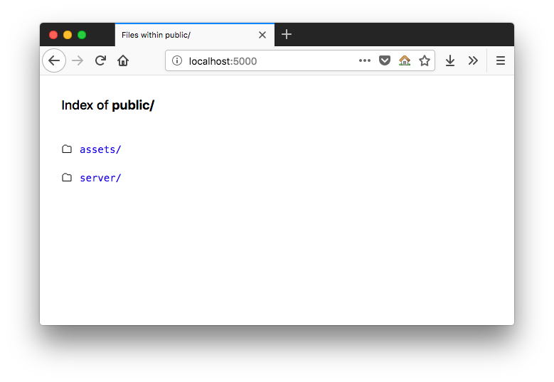

# Getting Started

This guide is here to help you get started with this repository, primarily if you've been contributing to the previous version of ownCloud's documentation, which used reStructuredText and Sphinx-Doc.

To contribute to the documentation, you need four things:

1. Learn [Antora's basics](https://antora.org).
2. Learn [the AsciiDoc file format's basics](https://asciidoctor.org/docs/asciidoc-syntax-quick-reference/).
3. Update your toolset so that it supports both AsciiDoc and Antora.
4. Start contributing to the new documentation repository.

To help you do that, this guide will step you through (or link you to) the required information and tools.

## The Antora Basics

[Antora](https://antora.org) is self-described as:

> The multi-repository documentation site generator for tech writers who :heart: writing in AsciiDoc.

While relatively new (*currently at release 1.0.3*), it's already a competent tool; one I expect makes developers' lives much more comfortable than competing platforms.
This is because Antora is:

- Based around [the AsciiDoc format](https://asciidoctor.org/docs/asciidoc-syntax-quick-reference/), a format far more akin to Markdown. Its syntax is _readable_, _concise_, _comprehensive_, _extensible_, and, above all, _easy to learn_.
- Provides a logical and structured way of organizing technical documentation.
- Enforces a clear and logical separation of text content and supporting assets (such as *images*, *videos*, and *code*).
- Uses a small set of tools, ones that are commonly available in developer tool sets, such as *Node* and *Git*.
- Provides very flexible project navigation.
- Natively links to different documentation versions within the UI;
- _Plus so much more!_

### What Antora Docs Look Like


In the screenshot above, you can see an example of what Antora documentation looks like (using a slightly modified default theme).
You can see that:

- The standard main navigation is at the top<sup>(1)</sup>.
- The secondary navigation is down the left-hand side<sup>(2)</sup>.
- There is breadcrumb navigation above the main content<sup>(3)</sup>.
- The main content is in a large pane on the right<sup>(4)</sup>.

While not revolutionary, the layout uses well-recognized and understood navigation conventions.
However, it has a rich navigational feature.
Notice the link right at the bottom<sup>(5)</sup>.
If you click it, it opens up a sub-navigation menu.



This is an excellent, time-saving feature that allows for direct navigation between different documentation versions (git branches).
In the current documentation, an extra page exists to link to the various versions of the documentation, such as for version *8.2*, *9.x*, and *10.x.*
However, by taking advantage of this feature in Antora, that's not necessary, thanks to this innovative feature.

I expect that it makes users lives so much easier, as they'll be able to navigate quickly to the version of the documentation that matches their ownCloud installation.

## The Antora Directory Structure

Now that you have an overview of what Antora is and how it renders documentation, the next thing you need to do is to understand the Antora directory structure.
That way you know where to find and create files.

I could describe it here, but [the Antora documentation](https://docs.antora.org/antora/1.0/component-structure/) does an excellent job already.
So go through the information and get yourself acquainted.

## The AsciiDoc Basics

Now that you know what Antora is and have a basic understanding of its directory structure, it's time to learn the AsciiDoc basics.
To quote [the AsciiDoc Syntax Quick Reference Guide](https://asciidoctor.org/docs/asciidoc-syntax-quick-reference/) (which you should bookmark*!*):

> AsciiDoc is a lightweight markup language for authoring notes, articles, documentation, books, web pages, slide decks and man pages in plain text. This guide is a quick reference for the common AsciiDoc document and text formatting markup.

If you look through the guide, you'll see that it's a file format which is quite similar to Markdown, supporting paragraphs, formatted text, headers, sections, section titles, lists, links, images, code, tables, videos, and so much more.

What's more, the format is **consistent** and **predictable**, as it has a definitive standard.
This is in stark contrast to Markdown, which has a series of (_often competing_) standards, such as [GitHub Flavoured Markdown](https://guides.github.com/features/mastering-markdown/), and [Daring Fireball](https://daringfireball.net/projects/markdown/).

AsciiDoc is a robust, text-based file format, which you can use to create even the most sophisticated technical documentation, able to be exported to a range of modern file formats.
Have a look through the quick reference guide, and the rest of the official AsciiDoc documentation to learn more.

## Writing & Editing AsciiDoc Files

To contribute to the documentation, you're only going to need 3 things; these are:

1. A text editor with AsciiDoc syntax support available.
2. Antora's build tools.
3. The AsciiDoc Quick Syntax Guide.

Let's step through each one.

### A Text Editor or an IDE

Just like writing in any other format or computer language, you're going to need a text editor or an IDE.
And as you're a developer, you'll already have one, and it likely supports AsciiDoc already.
If not there should be a plugin available for it.
Here are some of the text editors and IDEs that we recommend.

#### VIM


If you're using VIM (or VI), there are two plugins that you can make use of; these are dahu/vim-asciidoc, and matcatc/vim-asciidoc-folding.
vim-asciidoc provides enhanced editing support for Asciidoc files.
vim-asciidoc-folding allows vim to enable folding asciidoc files.

Alternatively, if you want both of these, plus some extra setup ready to go, you can use [the Vim for Technical Writers repository](https://github.com/settermjd/vim-for-technical-writers).
The repository has a `.vimrc` file that installs both plugins, enabling them only when editing Asciidoc files.

#### SublimeText


SublimeText doesn't come with native support for AsciiDoc, but you can install [the AsciiDoc package](https://github.com/asciidoctor/sublimetext-asciidoc) which provides it.
Once you do that, you'll have a range of AsciiDoc editing functionality available, including:

- Snippets
- Syntax Highlighting
- Keymaps
- Attribute completion
- Display document and section titles in the local symbol list

#### Atom


In recent months, Atom's been gaining significant traction.
Written primarily by the team at GitHub and supported by a massive community around the world, and packed with a wide range of features out of the box, it's easy to see why.

If it's your text editor of choice, install the [asciidoc-assistant](https://atom.io/packages/asciidoc-assistant) package.
This package is a meta-package that takes care of installing a range of plugins, which to give you full AsciiDoc support.

These are:

- [language-asciidoc:](https://atom.io/packages/language-asciidoc) This package adds syntax highlighting and snippets to AsciiDoc files.
- [asciidoc-image-helper:](https://atom.io/packages/asciidoc-image-helper) This package facilitates insertion of images in an AsciiDoc document.
- [asciidoc-preview:](https://github.com/asciidoctor/atom-asciidoc-preview) This package allows Atom to show the rendered HTML of the AsciiDoc content in the current editor.
- [autocomplete-asciidoc:](https://atom.io/packages/autocomplete-asciidoc) This package provides AsciiDoc language auto-completions in Atom.

#### Visual Studio Code


If you're on the Microsoft Windows platform or love the Visual Studio environment — and in particular the new "*Code*" editor/IDE — then you'll be happy to know that it supports AsciiDoc as well.
If you install [the AsciiDoc plugin](https://marketplace.visualstudio.com/items?itemName=joaompinto.asciidoctor-vscode), then you'll get some basic functionality, including:

- Live preview.
- Syntax highlighting.
- Open Preview to the Side.
- View Symbols and Go to Symbol actions.

#### IntelliJ IDEA


If you're a fan of IDEs over text editors, in particular, the JetBrains IntelliJ platform, then make sure you install [the AsciiDoc plugin](https://plugins.jetbrains.com/plugin/7391-asciidoc), available, from the JetBrains repository.

It provides a minimal set of functionality when editing AsciiDoc files, which includes:

- Live Preview (show editor and preview, the editor only, and preview only).
- Basic formatting toolbar (bold, italics, mono-spaced).
- Code folding.
- Syntax highlighting.
- Convert non-AsciiDoc files to AsciiDoc.

#### Using Another Text Editor or IDE?

If you're not already using one of these text editors of IDEs, don't feel the need to change to them, just because they're what we recommend.
It's possible that your existing text editor or IDE already has an AsciiDoc plugin.
And it makes far more sense to continue using what you already know, instead of learning an entirely new tool.

### Previewing Changes


Once your text editor or IDE is ready to work with AsciiDoc then, assuming it doesn’t already support live preview, you’ll need a way to preview the changes you’re making to ensure that they render as you expect.

For that, assuming that you’ve installed _Google Chrome_, _Mozilla Firefox_, or _Opera_, you need to install the AsciiDoc Live Preview plugin.
When installed, you can toggle AsciiDoc preview, and see AsciiDoc files rendered in the browser.

You can install the extension through the browser or find it through the links below.

- [Google Chrome plugin](https://chrome.google.com/webstore/detail/asciidoctorjs-live-previe/iaalpfgpbocpdfblpnhhgllgbdbchmia?hl=en)
- [Mozilla Firefox add-on](https://addons.mozilla.org/en-US/firefox/addon/asciidoctorjs-live-preview/)
- [Opera plugin](https://addons.opera.com/en/extensions/details/asciidoctorjs-live-preview/)

## Installing Antora

Installing Antora on your local development (virtual) machine doesn't take *too* much time, but there are a number of tools to install.
If you just want to make text changes, then installing the Asciidoc Live Preview Plugin may be sufficient for your needs.

Before you get started, make sure that your development machine is one of [the supported hardware platforms](https://docs.antora.org/antora/1.0/supported-platforms/#platforms).
After that, install the system requirements for your platform, whether that's [Linux](https://docs.antora.org/antora/1.0/install/linux-requirements/), [macOS](https://docs.antora.org/antora/1.0/install/macos-requirements/), or [Microsoft Windows](https://docs.antora.org/antora/1.0/install/windows-requirements/).

With that done, you're now ready to install Antora's two command-line tools; these are the Antora CLI and the default Antora site generator.
To install the Antora CLI, run the command: `npm i -g @antora/cli`.
You can then test that it's installed by running the command: `antora -v`.

To install the default Antora site generator, run the command: `npm i -g @antora/site-generator-default`.
This command installs it globally.
If you want to install it locally, remove the `-g` switch.

## Contributing to the Docs

You're now ready to work on the new ownCloud docs.
So, let's assume you've made a change to some aspect of the documentation, whether large or small, and you want to see what it looks like.

From the command line, in the root of the docs directory, run the command `antora site.yml`.
If all goes well, you will not see any console output.
However, if an aspect of your change (or one of the other files) contains invalid AsciiDoc, then you'll see output similar to the example below.

```console
asciidoctor: ERROR: index.adoc: line 25: only book doctypes can contain level 0 sections
```

There, you can see that an error was found, the file it was found in, and the line of that file where it is located.
Assuming that there are no errors, the next thing to do is to run the NPM web server so that you can view your changes, before committing and pushing the changes to the remote docs repository.

To do that, run the command `serve public &`.
This starts up the NPM web server, using the public directory, (re)generated by `antora site.yml`, as the document root.
By default, this starts the web server listening on http://localhost:5000 and copy the URL to the clipboard.


Open the URL in your browser of choice, and you'll see two links, as below.



Click "**server/**", and you'll see the local copy of the documentation.


If you're happy with your changes, as with any other change, create a set of meaningful commits and push them to the remote repository.
I hope that you can see that contributing to the documentation using Antora is a pretty straight-forward process, and not _that_ demanding.

