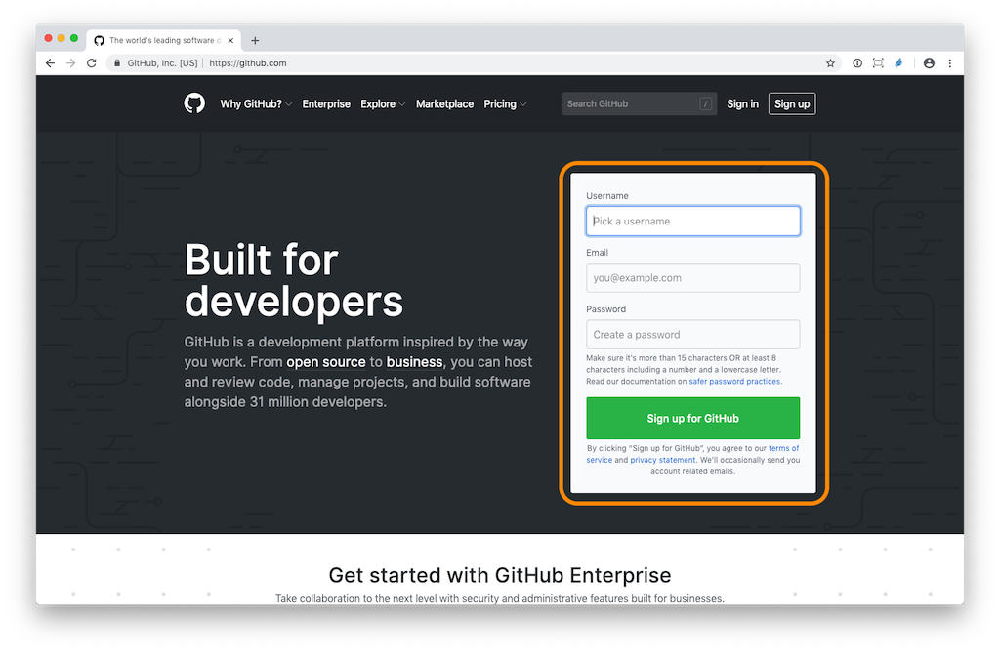
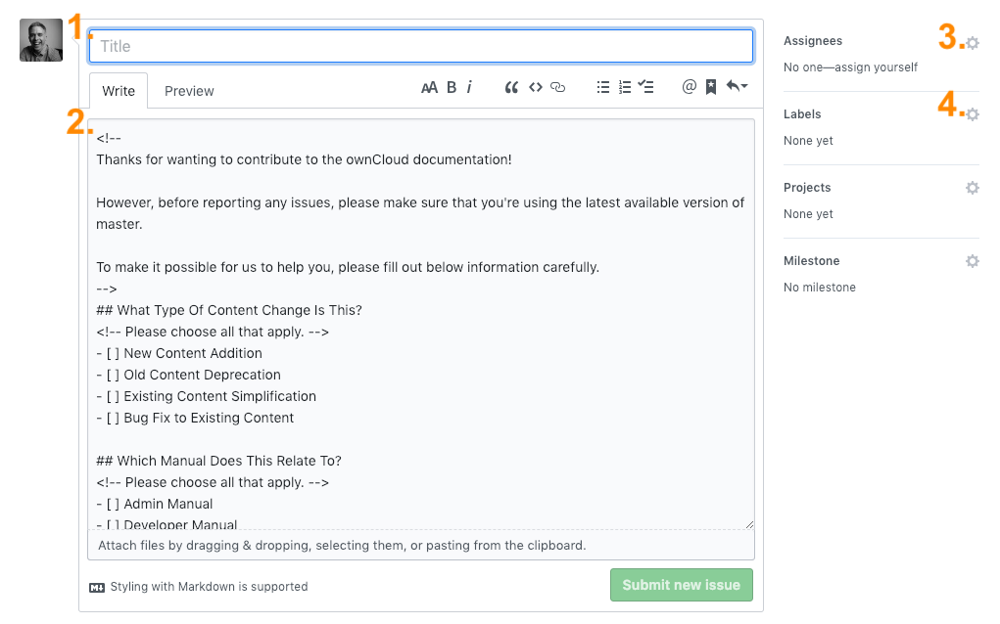
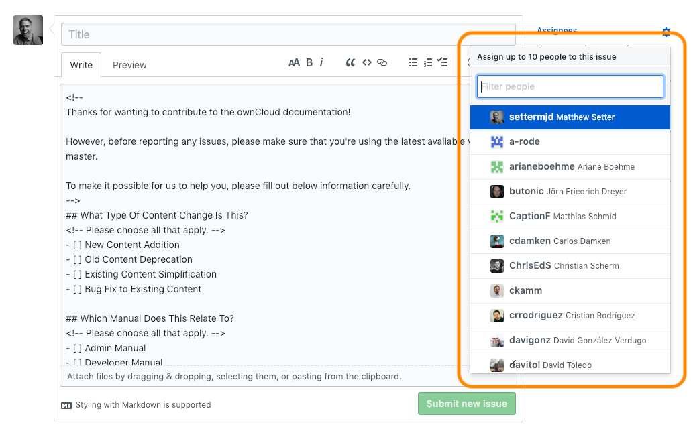
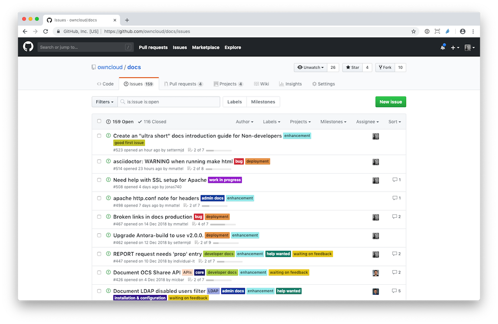

# Getting Started

This guide is here to help you get started with this repository, primarily if you've been contributing to the previous version of ownCloud's documentation, which used reStructuredText and Sphinx-Doc.

## For Non-Developers

Even if you’re not a developer, you can contribute to the ownCloud documentation by [creating new issues](#creating-new-issues) and contributing to the discussion around them. You don’t need to be familiar with how to write or edit code, nor install any software. All that you need is a web browser, such as [Google Chrome](https://www.google.com/chrome/index.html), [Mozilla Firefox](https://www.mozilla.org/en-US/firefox/new/), [Apple Safari](https://www.apple.com/safari/), or [Microsoft Edge](https://www.microsoft.com/en-us/windows/microsoft-edge).

**NOTE:** Most browsers support [live preview](#environmental-setups-depending-the-kind-of-changes).

### Initial Steps

Before you can contribute to the documentation, you need to:

1. [Have a GitHub account](#have-a-github-account).
2. [Know the AsciiDoc basics.](#asciidoc-basics)

#### Have a GitHub Account

If you don't already have an account, you can [sign up for a new one](https://github.com/). You only need to provide a _username_, _email address_, and a _password_.



#### Know the AsciiDoc Basics

While [the AsciiDoc file format](https://asciidoctor.org/docs/asciidoc-syntax-quick-reference/) is quite rich, you're likely to only need a small portion of it, a lot of the time. In the example below, you can see a small example which shows how to format _headers_, _paragraphs_, _links_, _lists_, and _source code_.

```asciidoc
= Top-Level Header

An introduction to http://asciidoc.org[AsciiDoc].

== Second-Level Header

* item 1
* item 2

[source,ruby]
====
puts "Hello, World!"
====
```

Have a read through [the AsciiDoctor Syntax Quick Reference](https://asciidoctor.org/docs/asciidoc-syntax-quick-reference/) to familiarise yourself with the format's essentials. Please also refer to [Best Practices and Tips](./best-practices.md) for more information.

#### Creating New Issues

Creating new issues is one of the most helpful ways to contribute to the ownCloud documentation. Issues document changes that need to be made because:

- Information is missing, incorrect, or outdated; or
- A new feature has been created that needs to be documented.

To create a new issue, open https://github.com/owncloud/docs/issues in your browser and click "_New Issue_" on the far right-hand side of the page. This takes you to the _New Issue_ form.



First, enter a concise title, that describes the change that needs to be made. Please make it *only* as long as it needs to be, the shorter, the better.

Next, enter a description that describes the required change in greater depth. The description field is pre-loaded with a template which is designed to help you fill out a meaningful description.

Four sections should be filled out (the more, the better):

1. What type of content change is this?
2. Which Manual Does This Relate to?
3. What Needs to be Documented?
4. Why Should This Change Be Made?

Each section has a comment, the text inside `<!--` and `-->`, designed to guide you about what you need to cover. The comment text is not visible when viewing the issue.

*Note:* The description text can be, if desired, formatted with [Markdown](https://guides.github.com/features/mastering-markdown/), which is a simple way of formatting text, to give it more significant meaning.

After you've filled out a title and description, optionally assign the issue to the most relevant people, by clicking the cog icon, on the right-hand side of the Assignee field, and selecting one or more users from the list that appears. You can also add one or more labels, to categorise the new issue, if you so choose.



Assigning an issue helps ensure that the issue can be acted on as soon as possible. If you're not sure whom to assign it to, please do not assign it to anyone.

Once you've completed these steps, at the bottom of the form, click the "_Submit new issue_" button, which creates the new issue, and optionally assigns it to the nominated people.

Now that the issue is created, the relevant developer(s) and other stakeholders can discuss the request, asking for clarification and further information if required, and can work through the request until it's completed. You will also see it in the issues list, which you can see an example of in the screenshot below.



## For Developers

### Initial Steps

To contribute to the documentation, you need to:

1. Learn [Antora's basics](./what-is-antora.md).
2. Learn [the AsciiDoc basics](./what-is-asciidoc.md).
   In addition, check out the Asciidoctor [Writers Guide](https://asciidoctor.org/docs/asciidoc-writers-guide/),  [User Manual](https://asciidoctor.org/docs/user-manual/), and [Syntax Quick Reference](https://asciidoctor.org/docs/asciidoc-syntax-quick-reference/).
3. Make sure you have [tools](./what-is-asciidoc.md#writing--editing-asciidoc-files) that can edit and preview AsciiDoc files.
4. Setup a [GitHub account](https://github.com/), if you haven't already.
5. Setup your local copy of the docs repository
6. Environmental setups depending on the kind of changes
7. Contributing to the documentation
8. Getting support

### Setup Your Local Copy of the Docs Repository

With this done, you then need to get your local copy of the docs repository ready. To do this, follow these three steps.

1. Fork [the docs repository](https://github.com/owncloud/docs/).
   This is necessary, as you won't be able to push changes directly to the docs repository.

2. Clone the docs repository locally and enter it.

    ```console
    git clone git@github.com:owncloud/docs.git
    cd docs
    ```

3. Add a remote to your fork, by substituting your GitHub username in the command below.

    ```console
    git remote add {username} git@github.com:{username}/docs.git
    git fetch {username}
    ```

### Environmental Setups Depending on the Kind of Changes

Depending on if you are making text changes only or if you change images, inline code examples or more complex content, you may need to use different tools to validate your outcome.

#### You Are Making Text Changes Only

If you're making text changes only, we recommend installing the AsciiDoc Live Preview plugin(s):

1. To your browser:
    - Firefox: [asciidoctorjs-live preview](https://addons.mozilla.org/en-US/firefox/addon/asciidoctorjs-live-preview)
    - Other [browser](https://asciidoctor.org/docs/editing-asciidoc-with-live-preview/) (The supported browsers are: *FireFox*, *Google Chrome*, or *Opera*, -- if *FireFox* installation fails, try the above instead).
2. To your [text editor or IDE](https://asciidoctor.org/docs/editing-asciidoc-with-live-preview/#using-a-modern-text-editoride), *if it has one*.

Using one, or both, of these, you can quickly check if the changes you make are what you expect, and if there are any render errors. If the document renders as expected, then you can commit the changes and push them to the docs repository.

**NOTE:** Any links to internal files, such as code samples, and images will not render correctly, as the paths do not contain the absolute path to the asset. Links to internal files can only be previewed when the documentation is generated with Antora.

#### You Are Working With Inline Code Examples, Images, and Attachments

If, however, you're linking to local files, such as inline code examples, images, and attachments, then you need to [install Antora's command-line tools](./install-antora.md). This is because the Live Preview plugin won't know the complete path to the local file, so won't be able to correctly render a link to it. All other kinds of links should work properly, however.

In this case, you need to use Antora to regenerate the documentation and manually check if there are any broken links or if something looks amiss.

Next, you need to learn how to [build the docs](./build-the-docs.md) from the command line and how to review the changes in your browser.

####  Broken Link Checker

To check for broken links manually, see [install and use a broken-link-checker](./checking-broken-links.md).

### Contributing to the Documentation

With that done, you're now ready to make regular contributions to the docs. To do that, here are the steps to follow to contribute changes.

1. Create a local development branch off of `master` or another development branch and switch to it.
   You can do this in one command: `git checkout -b {branch-name}`.
   We recommend naming the branch such that you'll recognize its purpose; e.g., `deprecate-some-occ-command`, `document-firebase-database-support`.
2. Do some work, commit, repeat as necessary.
3. Push the branch to your remote fork of the docs repository.
4. Send a pull request from your fork to the docs repository.

Here's an example of contributing to the documentation

```console
$ git checkout -b deprecate-some-occ-command
Switched to a new branch 'deprecate-some-occ-command'

... do some work ...

$ git commit
... write your log message ...

$ git push {username} deprecate-some-occ-command:deprecate-some-occ-command
Counting objects: 38, done.
Delta compression using up to 2 threads.
Compression objects: 100% (18/18), done.
Writing objects: 100% (20/20), 8.19KiB, done.
Total 20 (delta 12), reused 0 (delta 0)
To ssh://git@github.com/{username}/docs.git
   b5583aa..4f51698  HEAD -> master
```

#### Cleaning Up Your Branches After They're Merged

If you are a frequent contributor, you'll likely create many branches, both locally and remotely. To avoid confusing which ones are new and which are old, once your pull requests are merged into the master repository, we suggest removing the underlying branches. Here's how to do this.

##### Local Branch Cleanup

```console
$ git branch -d <branchname>
```

##### Remote Branch Removal

```console
$ git push {username} :<branchname>
```

**Note:** you can also delete a remote branch through the GitHub UI.

## The Branching Workflow

Please refer to [the branching workflow](./the-branching-workflow.md) to learn about how git branches are used to manage and build the documentation.

## Backporting

If you want or need to backport a merged PR, you can easily do that by using this linked script:
https://doc.owncloud.com/server/developer_manual/general/backporting.html#steps

## Build Pipeline and Web Deployment

Please refer to [the documentation build pipeline](./the-build-pipeline.md) to learn about how the documentation is built and deployed to production.

## Getting Support

If you need any support when making changes to the documentation, you can always get it in the `#documentation` channel in https://talk.owncloud.com. We're there to help you.
