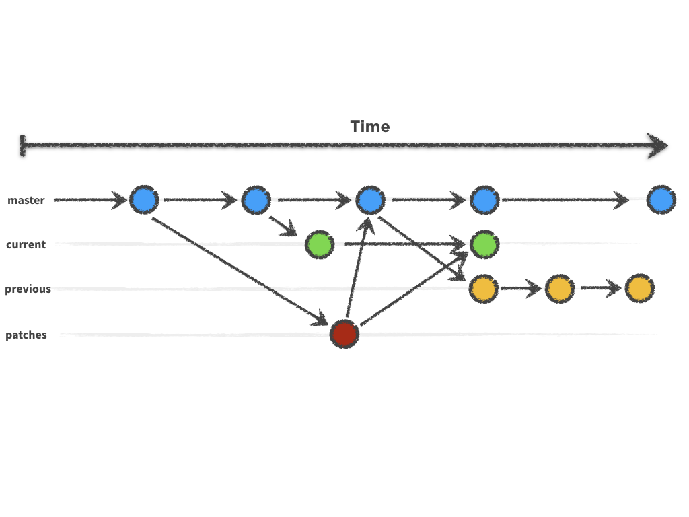

# The Branching Workflow

In addition to the `master` branch, each documentation repository will have _two_ branches at any one time; one for the current version of the software and one for the previous version.

The two, currently active, branches are:

- `10.2`: This tracks the current release of ownCloud core (10.2).
- `10.1`: This tracks the previous ownCloud core (10.1).

**Note:** [the default version of the docs](https://doc.owncloud.com) comes from `10.2`.

In addition to these three active branches, documentation changes (additions, corrections, and deprecations) are backported to some of the earlier branches.
This may seem like a strange thing to do, given that only the latest two branches reflect [the currently supported ownCloud versions].

However, given ownCloud's age, there are a significant number of installations in active use which do not use one of the two latest versions.
So, where possible, older documentation branches are updated so that administrators of these older installations have the most correct documentation available for their version.

## Workflow Aim

This approach aims to do two things:

- **Document the major _and minor_ release versions.** Doing so should make it easier for systems administrators, as well as ownCloud administrators and users, to maintain and use their ownCloud installations, because they can use the documentation **specifically-targeted at their installation's major and minor release**.
- **Reduce the documentation maintenance overhead.** If the documentation for each version only covered the major release, it would invariably need periodic minor — _and optionally patch_ — specific changes to cover _new_, _deprecated_, and _changed features_. While doing this, initially, would not incur too much overhead, over time it would become a maintenance nightmare.

## How It Works

- PRs that document _upcoming_ release-ready features are merged into `master` **only**. These changes will be included in the next release branch (10.3), when the time comes.
- PRs that correct mistakes are first merged to `master` and are then back-ported to any branches that have the mistake.
- PRs that expand/fill-in things that are "just missing" from the documentation, will need to be back-ported to all the branches (that are currently being published).

This approach will initially require greater effort from the contributors and maintainers.
This is because each feature branch, which is typically branched from and merged back to master, also needs to be backported to at least one of the version-specific branches — _if not two_.
However, if PRs are small enough, then this shouldn't be too much work.

In the not-too-distant future, a script will be developed to automate as much of this as possible.
When it's complete, it will be documented here.

[the currently supported ownCloud versions]: https://github.com/owncloud/core/wiki/Maintenance-and-Release-Schedule
