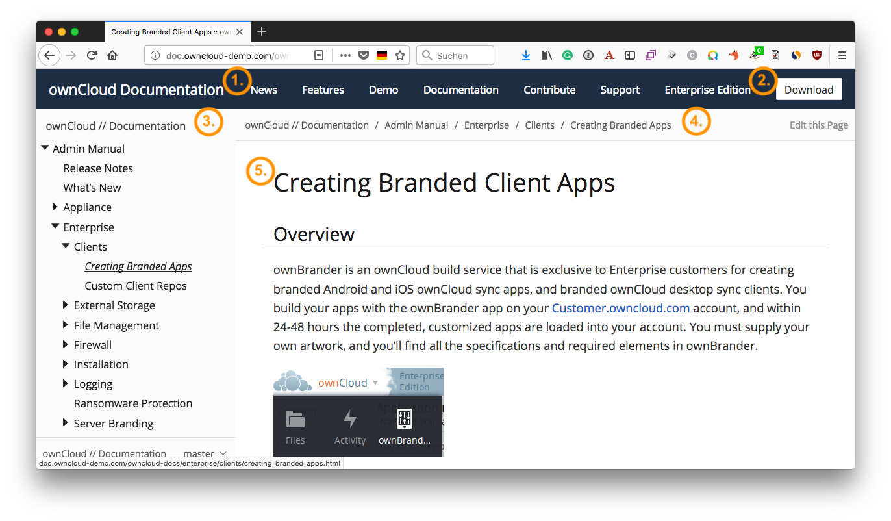

# Antora

[Antora](https://antora.org) is self-described as:

> The multi-repository documentation site generator for tech writers who :heart: writing in AsciiDoc.

While relatively new (*currently at release 2.0.0*), it's already a competent tool; one I expect makes developers' lives much more comfortable than competing platforms. This is because Antora is:

- Based around [the AsciiDoc format](https://asciidoctor.org/docs/asciidoc-syntax-quick-reference/), a format far more akin to Markdown. Its syntax is _readable_, _concise_, _comprehensive_, _extensible_, and, above all, _easy to learn_.
- Provides a logical and structured way of organizing technical documentation.
- Enforces a clear and logical separation of text content and supporting assets (such as *images*, *videos*, and *code*).
- Uses a small set of tools, ones that are commonly available in developer tool sets, such as *Node* and *Git*.
- Provides very flexible project navigation.
- Natively links to different documentation versions within the UI;
- _Plus so much more!_

### What Antora Docs Look Like

In the screenshot above, you can see an example of what Antora documentation looks like (using a slightly modified default theme). You can see that:

- The standard main navigation is at the top(1).
- The secondary navigation is down the left-hand side(2).
- There is breadcrumb navigation above the main content(3).
- The main content is in a large pane on the right(4).

While not revolutionary, the layout uses well-recognized and understood navigation conventions. However, it has a rich navigational feature. Notice the link right at the bottom(5). If you click it, it opens up a sub-navigation menu.

This is an excellent, time-saving feature that allows for direct navigation between different documentation versions (git branches). In the current documentation, an extra page exists to link to the various versions of the documentation, such as for version *8.2*, *9.x*, and *10.x.* However, by taking advantage of this feature in Antora, that's not necessary, thanks to this innovative feature.

I expect that it makes users lives so much easier, as they'll be able to navigate quickly to the version of the documentation that matches their ownCloud installation.

## The Antora Directory Structure

Now that you have an overview of what Antora is and how it renders documentation, the next thing you need to do is to understand the Antora directory structure. That way you know where to find and create files.

I could describe it here, but [the Antora documentation](https://docs.antora.org/antora/1.0/component-structure/) does an excellent job already. So go through the information and get yourself acquainted.
