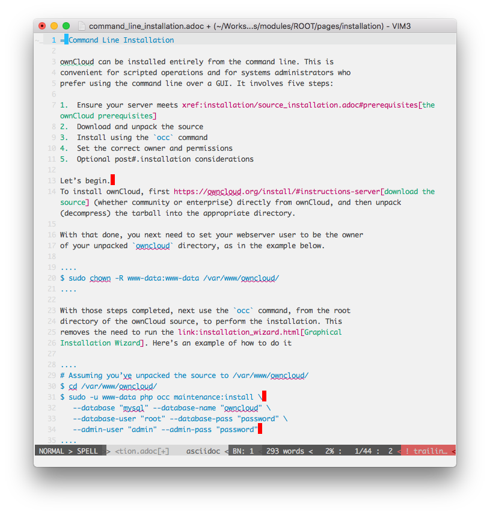
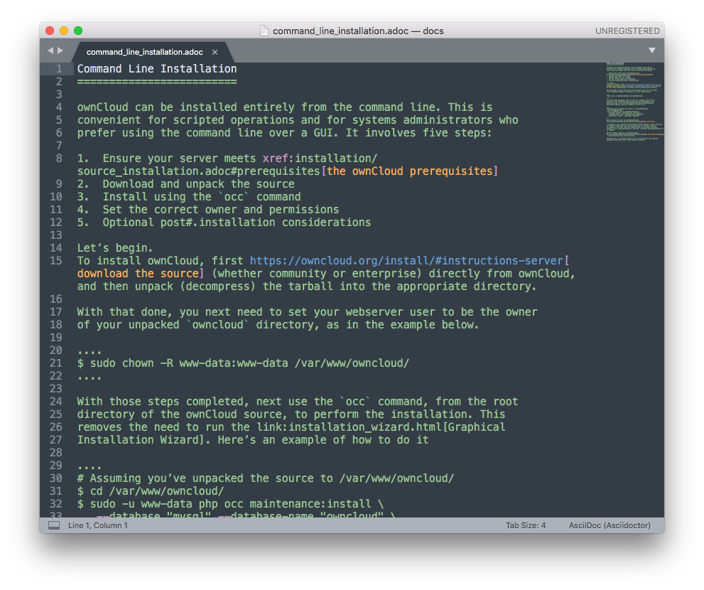
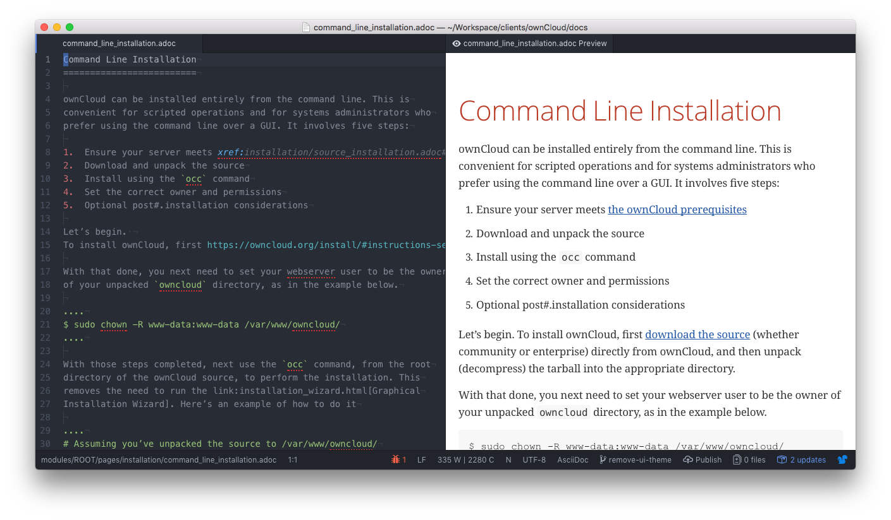
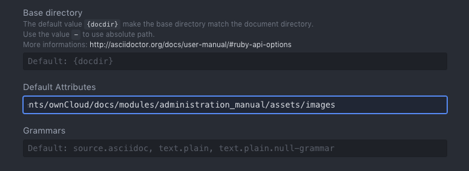
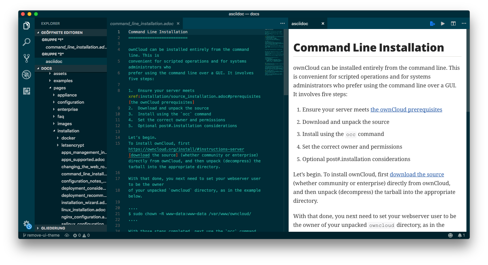
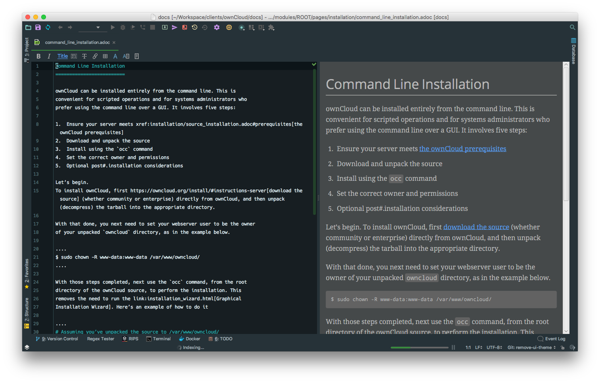
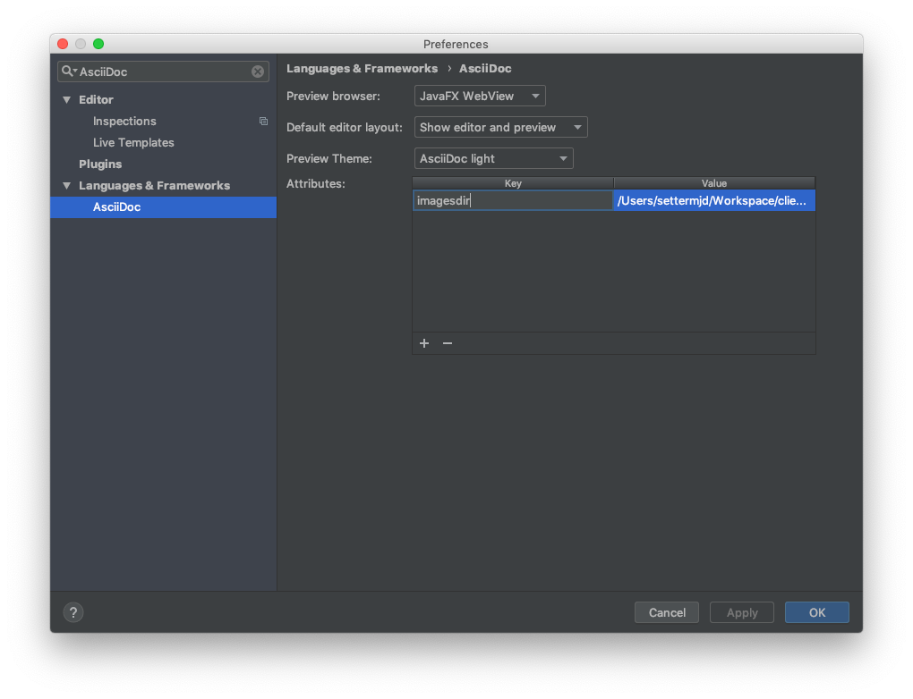
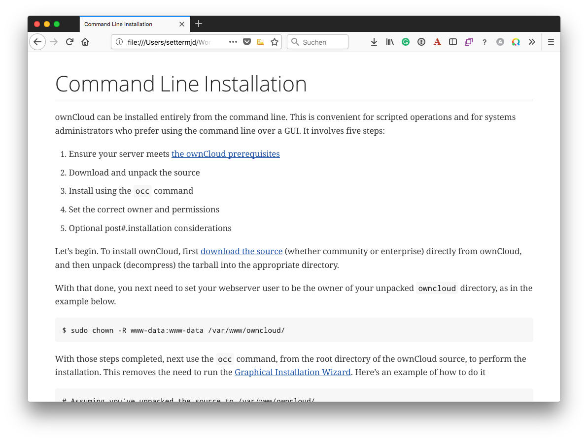

# What is AsciiDoc?

To quote [the AsciiDoc Syntax Quick Reference Guide](https://asciidoctor.org/docs/asciidoc-syntax-quick-reference/) (which you should bookmark*!*):

> AsciiDoc is a lightweight markup language for authoring notes, articles, documentation, books, web pages, slide decks and man pages in plain text. This guide is a quick reference for the common AsciiDoc document and text formatting markup.

If you look through the guide, you'll see that it's a file format which is quite similar to Markdown, supporting paragraphs, formatted text, headers, sections, section titles, lists, links, images, code, tables, videos, and so much more.

What's more, the format is **consistent** and **predictable**, as it has a definitive standard.
This is in stark contrast to Markdown, which has a series of (_often competing_) standards, such as [GitHub Flavoured Markdown](https://guides.github.com/features/mastering-markdown/), and [Daring Fireball](https://daringfireball.net/projects/markdown/).

AsciiDoc is a robust, text-based file format, which you can use to create even the most sophisticated technical documentation, able to be exported to a range of modern file formats.
Have a look through the quick reference guide, and the rest of the official AsciiDoc documentation to learn more.

## Writing & Editing AsciiDoc Files

To contribute to the documentation, you're only going to need 3 things; these are:

1. A text editor with AsciiDoc syntax support available.
2. An AsciiDoc previewer.
3. AsciiDoc documentation

Let's step through each one.

## A Text Editor or an IDE

Just like writing in any other format or computer language, you're going to need a text editor or an IDE.
And as you're a developer, you'll already have one, and it likely supports AsciiDoc already.
If not there should be a plugin available for it.
Here are some text editors and IDEs that we recommend.

### VIM

If you're using VIM (or VI), there are two plugins that you can make use of; these are dahu/vim-asciidoc, and matcatc/vim-asciidoc-folding.
vim-asciidoc provides enhanced editing support for Asciidoc files.
vim-asciidoc-folding allows vim to enable folding asciidoc files.

Alternatively, if you want both of these, plus some extra setup ready to go, you can use [the Vim for Technical Writers repository](https://github.com/settermjd/vim-for-technical-writers).
The repository has a `.vimrc` file that installs both plugins, enabling them only when editing Asciidoc files.

### SublimeText

SublimeText doesn't come with native support for AsciiDoc, but you can install [the AsciiDoc package](https://github.com/asciidoctor/sublimetext-asciidoc) which provides it.
Once you do that, you'll have a range of AsciiDoc editing functionality available, including:

- Snippets
- Syntax Highlighting
- Keymaps
- Attribute completion
- Display document and section titles in the local symbol list

### Atom

In recent months, Atom's been gaining significant traction.
Written primarily by the team at GitHub and supported by a massive community around the world, and packed with a wide range of features out of the box, it's easy to see why.

If it's your text editor of choice, install the [asciidoc-assistant](https://atom.io/packages/asciidoc-assistant) package.
This package is a meta-package that takes care of installing a range of plugins, which to give you full AsciiDoc support.

These are:

- [language-asciidoc:](https://atom.io/packages/language-asciidoc) This package adds syntax highlighting and snippets to AsciiDoc files.
- [asciidoc-image-helper:](https://atom.io/packages/asciidoc-image-helper) This package facilitates insertion of images in an AsciiDoc document.
- [asciidoc-preview:](https://github.com/asciidoctor/atom-asciidoc-preview) This package allows Atom to show the rendered HTML of the AsciiDoc content in the current editor.
- [autocomplete-asciidoc:](https://atom.io/packages/autocomplete-asciidoc) This package provides AsciiDoc language auto-completions in Atom.

**Note:** to view images in the preview pane, you have to set the `imagesdir` attribute in the AsciiDoc plugin's preferences.
To do that:

1. Open the Preferences pane for the "_asciidoc-preview_" package.
2. In the "_Default Attributes_" field, under "Settings", add _the absolute path_ to the image directory for one of the modules, at the end of the existing attributes.

Unfortunately, you cannot reference multiple image directories.

### Visual Studio Code

If you're on the Microsoft Windows platform or love the Visual Studio environment — and in particular the new "*Code*" editor/IDE — then you'll be happy to know that it supports AsciiDoc as well.
If you install [the AsciiDoc plugin](https://marketplace.visualstudio.com/items?itemName=joaompinto.asciidoctor-vscode), then you'll get some basic functionality, including:

- Live preview.
- Syntax highlighting.
- Open Preview to the Side.
- View Symbols and Go to Symbol actions.

**Note:** I’m not, currently, aware of how to enable rendering images in the preview pane.

### IntelliJ IDEA

If you're a fan of IDEs over text editors, in particular, the JetBrains IntelliJ platform, then make sure you install [the AsciiDoc plugin](https://plugins.jetbrains.com/plugin/7391-asciidoc), available, from the JetBrains repository.

It provides a minimal set of functionality when editing AsciiDoc files, which includes:

- Live Preview (show editor and preview, the editor only, and preview only).
- Basic formatting toolbar (bold, italics, mono-spaced).
- Code folding.
- Syntax highlighting.
- Convert non-AsciiDoc files to AsciiDoc.

**Note:** to view images in the preview pane, you have to set the `imagesdir` attribute in the AsciiDoc plugin's preferences.
To do that:

1. Open the Preferences pane and filter by `"AsciiDoc"`.
2. In the "_Attributes_" field, add a new entry, where "_Key_" is set to `imagesdir` and "_Value_" is set to _the absolute path_ to the image directory for one of the modules.
3. Click either "_Apply_" or "_OK_".

Unfortunately, you cannot reference multiple image directories, whether by using a regular expression, nor can you specify `imagesdir` multiple times.

### Using Another Text Editor or IDE?

If you're not already using one of these text editors of IDEs, don't feel the need to change to them, just because they're what we recommend.
It's possible that your existing text editor or IDE already has an AsciiDoc plugin.
And it makes far more sense to continue using what you already know, instead of learning an entirely new tool.

## An AsciiDoc Previewer

Once your text editor or IDE is ready to work with AsciiDoc then, assuming it doesn't already support previewing AsciiDoc, you’ll need a way to preview the changes you’re making to ensure that they render as you expect.

For that, assuming that you’re using one of _Google Chrome_, _Mozilla Firefox_, or _Opera_, you need to install the [AsciiDoc Live Preview plugin](https://asciidoctor.org/docs/editing-asciidoc-with-live-preview/).
When installed, enable the AsciiDoc Live Preview plugin, and you will see AsciiDoc files rendered as HTML in the browser.

## AsciiDoc Documentation

As with anything of a technical nature, you need documentation, because there’s going to come a time that you will need to refer to it.
So too with AsciiDoc.
Here are a set of links to documentation that you can bookmark and use on a regular basis:

- [The AsciiDoc Syntax Quick Reference Guide](https://asciidoctor.org/docs/asciidoc-syntax-quick-reference/)
- [Powerman's AsciiDoc Cheatsheet](https://powerman.name/doc/asciidoc)
- [The AsciiDoc Markup Syntax Summary](https://is.muni.cz/el/1433/podzim2015/PB162/um/printable/asciidoc.html)
